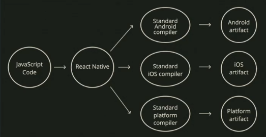

# React Native

React native targets existing compilers that accept Java/Kotlin (Android) or Objective C/Swift (IOS)



## What is Expo?

**Expo** is essentially a suite of tools built for and around React Native, designed to improve and enhace the developer experience.

- Use Expo instead of plain React Native because native IOS apps can only be built on macOS machines
- If you have windows, Expo overcomes this by allowing you to install a native shell on you phone and transfer the JS bundle directly into the native shell. You end up only writing JS on local, no native compilation stepo neceessary

### Restrictions:

- If you need to add any native code or code that isnt built into expo you would need to do something called ejecting
- **Ejecting:** converting expo application vanilla react app

### Adding a linter

Plain react native comes with a linter preinstalled. Expo does not come with one. Adding a linter improves experience.

### Debugging

To pull up debug menu

- On Device: shake device
- On IOS simulator: command + d
- On Android simulator: command + m

**Options:**

- Reload - redownloads the JS module (usually has hot reload)
- Debug - opens a react native debugger

# React Native Tags

- Text - MUST be used to display text or error will appear
- View
- ScrollView
- SafeAreaView - screen starts at top of phone and may cut off text or images on screen. This allows the items to be rendered below the notification bar

# Styling

Use StyleSheet element which is an object that holds styling. Display flex is default in react native

- flex: 1 - makes content the same height as parent. Need all components up the tree to use flex: 1 or it won't work
- Can pass in array of styles style={[obj.key, obj.key]} for shared styles

# Components

### Lists

If you need to render a list of elements, should not use map in react native due to performance issues. Use **FlatList or SectionList**. React Native will render every item on screen and re-render all of them regardless of whether data is changed. Lists have built in scroll. Only use ScrollView if list is not used.

- FlatList - Takes 3 props:

  - data - array of data you want to map
  - renderItem - function passed the item and it's index and will return individual item component
  - keyExtractor - function that gets passed an item and it's index
  - some useful props: ItemSeparatorComponent, List Empty Component
  - extraData - FlatList only gets re-rendered if DATA changes. If what you want to desplay depends on EXTERNAL FACTORS, use extraData to pass in any variables that should trigger a re-render

- SectionList - similar to FlatList but allows you to render items in sections with header in between them. Takes in props:
  - sections - array of objects
  - keyExtractor - function that gets passed an item and it's index
  - renderItem - function passed the item and it's index and will return individual item component
  - renderSectionHeader - function to display title

# Navigation

If using expo use React Navigation over React Native Navigation

### Installing navigation with Expo

Install navigation library

```
npm install @react-navigation/native
```

Add all expo-compatible dependencies

```
expo install react-native-gesture-handler react-native-reanimated react-native-screens react-native-safe-area-context @react-native-community/masked-view
```

Install stack navigator

```
npm install @react-navigation/stack
```

### Adding navigation to app

Two main types of navigation: Bottom and Stack Navigation.

**Important:** All bottom nav pages that you have renders as soon as you open app (be mindful of complex data fetching)

Navigation inside pages is in stacks

- When you navigate from a page on bottom nav it stacks on top of the current page but still stays on same bottom nav
- if you click a different bottom nav and go back to the previous it will still show the page you navigated to on the specific bottom nav page (does not auto reset page)
- Anything wrapped in Navigation gets navigation prop which contains various convenience functions (navigate, reset, goBack, addListener, setParams, dispatch, dangerouslyGetParent)

### Touchable Components

- TouchableOpacity - wrapped component has opacity applied when touched
- TouchableHighlight - wrapped component darkens when touch is in progress
- TouchableWithoutFeedback - no visual feedback
- TouchableNativeFeedback - (androids only) adds android-style touch feedback

# Forms
There are no restraints in having everything in a form element like web app but need to track each part of the form

Different inputs:
- TextInput (Most Popular)
- Picker
- Switch
