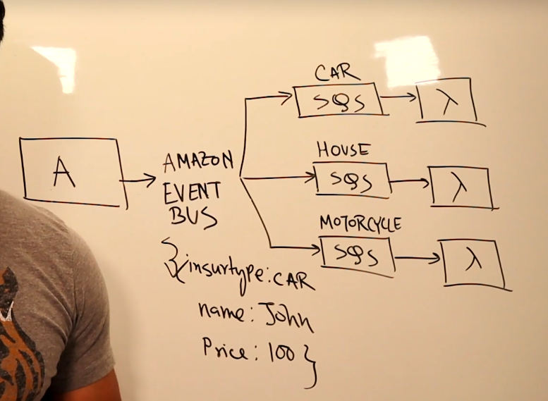
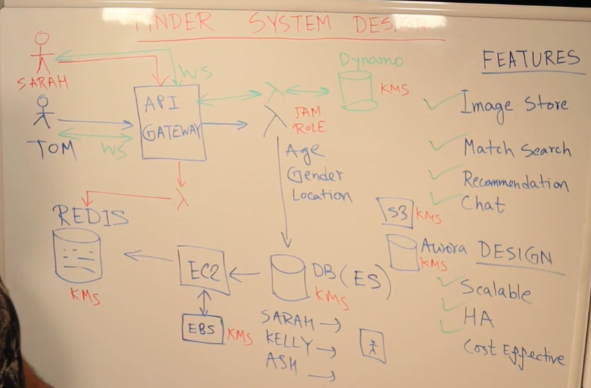
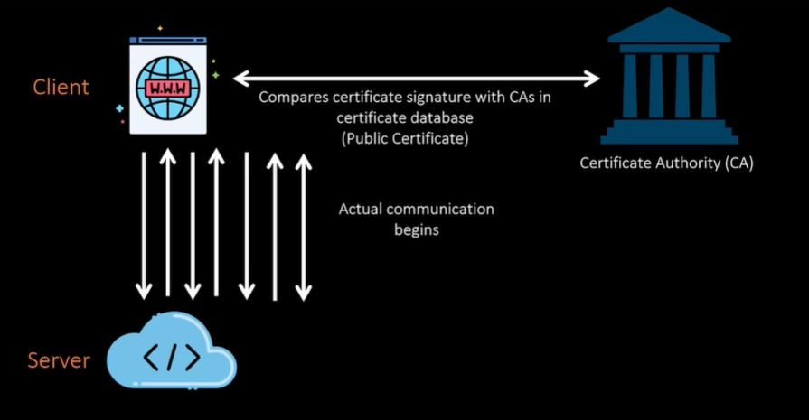
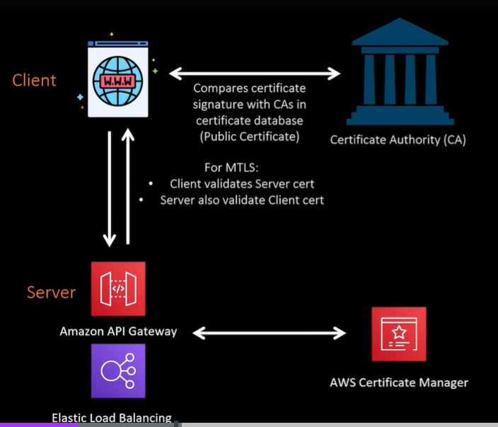
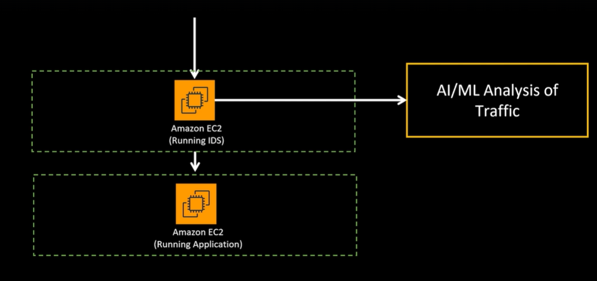
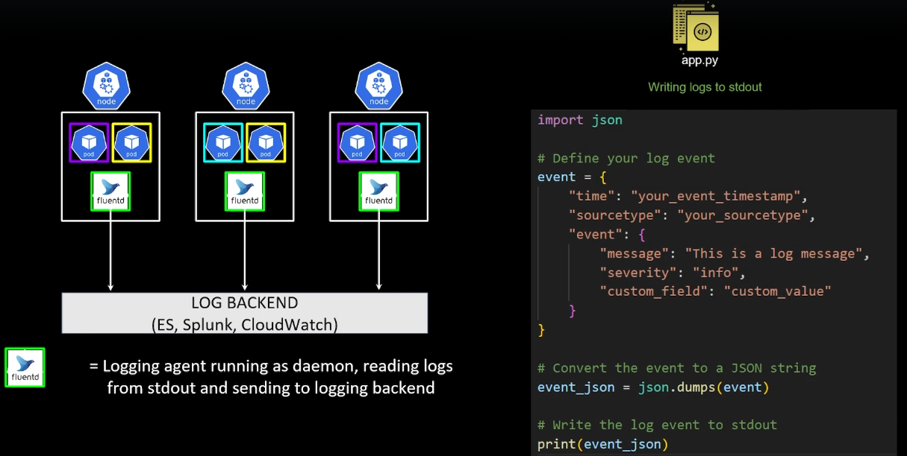

# AWS Well Architectured Framework

AWS Well'Architected provides consistent approach to evaluate architectures, and implement designs that can scale over time

This is done by evaluating architecture using 5 pillars:
- **Operational excellence**
    - focuses on running and monitoring systems to make sure if something goes down, it can be brought up. Makes sure disaster can be detected quickly.
- **Security**
    - focuses on protecting information and systems
- **Reliability (most important pillar)**
    - ensures that app is running reliably (if traffic goes up or availability zone goes down, app should be able to handle that)
- **Performance Efficiency**
    - ensures that the way app is running is performant (is EC2 optimized for performance)
- **Cost Optimization**
    - ensures app is cost optimized

For real world system design, you need to know the priority.

In interviewer asks how you ensure the design you are doing is good?
- You are designing based on the 5 pillars and priority of app

# Three-Tier Architecture using VMs or EC2s (Popular system design for interviews)
This architecture has 3 distinct layers or tiers
- Presentation layer (Frontend)
    - interacts with backend using APIs
- Application Layer (backend)
    - saves and retrieves info from database as needed
- Database

### Presentation Layer (Frontend)
Ex. Amazon.com website where you can browse different items
- This could be running on nginx, apache web server, etc

Lets say user wants to add item to cart
- when user clicks add to cart, you have to insert info into db and check business logic such as address, credit card info, etc.
- presentation layer calls the backend where business logic is running

### Application Layer (Backend)
Ex. Java code running in a jar file which runs in Apache Tomcat, Oracle WebLogic Server, etc.

### Database
Could be oracle, MySQL, PostgreSQL

### One way to design this
- You can run webserver on virtual machine (EC2)
- You can run appserver on EC2
- Appserver can communicate with database
- Both EC2 can have IP Address

## POPULAR INTERVIEW QUESTION: How will webserver access appserver and how will user access webserver from internet?
- Because you cannot hard code these IP addresses into app because EC2 could go down or you may need to scale

You communicate between appserver and webserver using Load Balancers so user can access webserver by using the DNS attached to Load balancer which points to webserver

## POPULAR INTERVIEW QUESTION: What are the single points of failure in this architecture?
Elastic load balancers are managed by cloud provider and inherently highly available
- under the hood, this load balancer is running in 3 availability zones
- This is NOT a single point of failure

HOWEVER The Appserver, Webserver and Database are single points of failure

### How will you make this architecture scalable and highly available?
- Done by putting the EC2s in appserver and webserver into autoscaling group and should have at least 2 webserver and appserver EC2s in 2 different availability zones

## POPULAR INTERVIEW QUESTION: How are you going to secure this design from the network perspective
- You want to put as many components in the private subnet or green zone as possible
- only thing that should be on the yellow or red zone or public subnet is the elastic load balancer fronting that webserver so internet traffic can come to that load balancer

Can also implement network security constructs for AWS:
- Network Access Control List (NACL)
- Security Group (on EC2s to control traffic)
- Integrate Web Application Firewal (WAF) with load balancer
    - lets you monitor web requests and protect app from malicious requests

## POPULAR INTERVIEW QUESTION: How about database?
You can ask a lot of probing in this area:
- SQL vs. NoSQL (push convo towards AWS Native databases)
- AWS Native Databases
    - offers out of the box high availability, fault protection and replication

Lets say you use Amazon Aurora
- out of the box it is Multi-AZ (one copy of data is save in multiple availability zones)
- if 1 zone goes down, aurora automatically promotes copy of data as primary instance
- if you want resiliency beyond a single region, use Global Database which replicates database in another region
- These features are available on dynamoDB as well

## POPULAR INTERVIEW QUESTION: How about database optimization?
How do you handle high traffic?

How can you optimize the database?

- Aurora provides **Read Replica** which handles read traffic while the write traffic goes to primary instance
- Caching layer using amazon Elasticache and utilize caching in different layers of architecture
- Query tuning for app

# Three Tier Architecture using Serverless and Containers
It will look like this with serverless

- Static content (such as html pages) will be stored in amazon S3 buckets

When user clicks button that requires business logic validation or info retrieved or saved into database (dynamic content)
- api is called to get, post or delete data
- api will be hosted on Amazon API Gateway

Business Logic will be in AWS Lambda

Beauty of serverless design
- Do not need to worry about making this design highly available or scalable since it already is out of the box

## Three tier architecture with Kubernetes
- web and app server will be running in container within a pod
- made highly available by deploying at least 2 pods for each in diff availability zones

From here you have option
- pods can run withing EC2 worker node
- run this as fargate

These are made scalable by utilizing kubernetes scaling constructs
- ReplicaSet
- HPA
- Cluster Autoscaler

The load balancer fronting the webserver will be ALB Ingress

For backend it could be ALB Ingress or kubernetes service

# DESIGN a Content-Based Message Routing Architecture
Lets say A is a system for an insurance company
- Anytime someone purchases insurance, System A has to send messages for different insurance coverages to different backend processing

### How would you design this system so System A could deliver messages to these backends

Bad Answer:
- System A will cal APIs to these different backend systems
    - ex. if type is car, call car backend system
    - not good because when there is high volume of customers, systems need to scale up at the same time.
- System A puts messages into queue (SQS) and you have lamda or EC2 to grab all messages and based on message type it calls different backend systems
    - this causes lambda or EC2 to become a bottle neck
    - if single lamda handles processing and volume of one insurance type goes up, it can impact other insurance type processing by taking over limit of lambda

Ideal solutions:
- System A publishes messages into SNS topic which can do filtering based on metadata
    - metadata is not the message body but is the property of the message which can have a field such as insurance type
    - SNS topic can send messages to the queues separately for processing
    - then you can process using lambda or EC2 and each queue and backend can scale independently
    
- If you want to use actual message field instead of metadata, you can do so using EventBus
    - EventBus can look at the field insurance type and send it to the correct SQS
    - Can also do advanced conditions, so if insurance type is x and name is y then send here
    - Why not just use EventBus? It is a little more expensive so switch to SNS if too expensive
    - SNS and SQS can scale infinitely but EventBus has limits on scaling
    

# DESIGN Image Storage and Retrieval Architecture
This is reusable and is used in other bigger use cases such as Amazon, Tinder, Shopify, etc.

When it comes to saving/storing images, you have 2 options:
- save in database as blob object
- save as object in object storage such as S3

Keep in mind when you save image and user is trying to retrieve the image, it is not always the same image
- When uploading on facebook or instagram, you can upload with high resolution but if you check the image on feed you might notice it is pixelated (meaning it was downscaled based on user device to save bandwidth)
- Saving and retrieving images involves processing such as downsampling image for different resolutions
- almost all architecture that deals with high volume of images uses object restorage or S3 to sacrafice speed for a cheaper cost

Amazon S3
- highly scalable, available and durable
- Each S3 is replicated across multiple availability zones

### How to design saving image

Lets say user uploads jpg and invokes an API hosted on API gateway
- this gateway will call a backend lambda
- lambda will save image in S3 bucket
- within S3 bucket, image will be saved in folder named ny/images/male
- image this is tinder meaning there will be multiple S3 buckets in diff regions with subfolders for states

Things to keep in mind
- API gates can directly save to S3 if you do not need any business processing but generally lamda will do some processing (such as image having explicit content)
- Lamda will put the location of the image in a database
    - if there are multiple S3 buckets with different data structure, you do not want to hard code everything into retrieval code
    - So when lamda saves in bucket it will at the same time save location into database (ex. dynamoDB)
- For upscaling/downscaling images, from S3 you trigger lambda which uses image kit to downscale/upscale
    - This lambda can scale image in different formats and store in different S3 buckets
    - once saved, it will put an entry into dynamoDB table for different resolutions
- if there is no need to process for explicit images, you can skip first lambda

### Retrieving Images
Much simpler than saving
- User invokes API Gateway with name of image
- backend lambda will go to dynamoDB (user tries to fetch from their device and app website can detect device type and set header)
- based on device type, dynamoDB will have folder location of specific resolution image in S3 bucket

# DESIGN a High Priority Queuing/Messaging System
Lets say you have 2 systems (A & B)
- System A receives messages and has to send messages to system B but certain messages need to be processed fast

Ex. Insurance Company want to process car insurance messages first

Option 1 (Highly unlikely for interview):
- Use a rabbitMQ where you can set a priority value in header in message
- Listener will pick up higher priority messages first

Option 2 (Popular option):
- Design using SQS (does not have default priority headers)
- Done by creating 2 different queues
    - one for car insurance and one for other
- On processing side, you can process using EC2 or Lambda (inside auto scaling group which can be set to be based on volume in SQS)
- Other EC2 doesn't need auto scaling group to save cost (if cost not issue then use ASG)
    - For Lambda, you can control memory

    

Option 3:
- If interviewer wants all that managed in another AWS service instead of system A
- Done by using Amazon Event Bridge with pattern matching
    - based on value in certain fields, you can send to diff target

    

### Why do we need SQS?
You can call directly to EC2 or Lambda, but when message fails to process then it is lost
- SQS has a requeue feature which will saved failed sends and resend it meaning you don't need code in EC2 to handle

# Data Analytics System Design on AWS
### Steps of Data Analytics
- Collect Data
- Transform Data based on requirements
- Query data to find necessary info
- Create Reports that give business insights

### Sample Architecture 1: Query and report on click stream data
Click Stream:
- Needs website and need to track clicks
- stream using streaming service like Amazon Kinesis or Kafka
- Dump all data in Amazon Simple Storage Service (Data in S3 is unstructured since is object based storage)
- AWS Glue uses crawlers to go through data in objects and find metadata of the data catalog of that data
    - Metadata or Data catalog mean what are the fields and types of the data
- AWS glue catalog will say in this S3 bucket this data can fit in this data structure
- You can query using amazon Athena which can read glue catalog and query
- can also define dashboards using QuickSight

### Sample Architecture 2: ETL (Extract, Transform, Load) and data warehouse
ETL
- Data collection part is similar
- AWS glue can define metadata and read data based on that S3 bucket and transform that data (remove columns, change values) and load into another S3 bucket

Data warehousing
- done with Amazon Redshift using Redshift spectrum
    - this directly running SQL queries from S3 bucket

Alternative
- AWS glue can after ETL load data into Redshift Tables
- Redshift you can define tables, indexes, keys and redshift queries are generally faster than athena

### What is AWS Glue?
- Serverless data integration service making it easier to discover prep and combine data for analytics
    - serverless means it will scale as needed and you only pay per use
- Glue crawlers can run on data and discover types of column and data (metadata)
- Can visually create ETL flows (Supports python/spark and Scala)
- Enrich, clean and normalize data without code
- Replicate data across various services

### Sample Architecture 3: Unified catalog across multiple data stores
Input Data Sources
- Redshift
- S3 Bucket
- Amazon RDS
- Database running on EC2

Run AWS glue which creates glue data catalog
- Can join catalog across different data sources and run sql queries using redshift and athena and also run big data process with Amazon EMR

If interviewer asks about dashboarding or reporting
- use Amazon QuickSight

Amazon EMR
- Managed big data platform
- Runs open-source tools (Apache Spark, Hive, Hbase, Flink, Hudi, Presto)
- Run on EC2 or EKS (Elastic Kubernetes Service), or on-prem using EMR on Outposts

### Sample Architecture 4: Big data analysis of click stream data
Ex. Data getting dumped in S3 storage and EMR reading through it
- EMR cannont directly read from S3 unless it know the metadata
- AWS Glue needs to crawl data and create glue data catalog

### Sample Architecture 5: In Stream querying and ETL
What if you need to query on data in stream before it's dumped?
- sometimes you want to perform selective loading of data to save space (not dump all data into S3)
- Data Gathering part is done by Kinesis Data Streams on Kafka
- Once you have data, put in Kinesis Data Analytics to transform and analyze data in real time
- Then send Kinesis data Firehousse which dumps into S3 bucket

### Data Lake
Purpose is the four steps

In interview ask: Should you do analytics when data in stream or after or does it need data warehousing?

Most important thing to remember is Data Lake holds massive amount of data
- S3 is at the heart of a Data Lake as main storage service (scalable, cost effective, has tiers, can run queries, warehousing)

# Performance Cost and Optimization
How to tackle Challenges Faced Question
- Asked can you tell me challenges you faced

When Tackling any tuning/troubleshooting keep in mind:
- Monitor
    - Logs (app logs)
    - metrics (shows utilization of infrastructure, how much cpu, memory used, is app throttling)
    - traces (how much time each line of code takes)
- Measure
    - Define KPI (say if line of code takes more than 1 sec then its a problem)
    - Send alarm
- Remediate
    - change configuration (higher EC2, move to GPU based EC2)
    - chnge code (most time sensitive and costly)

### EC2 Based App
Backend of API and is not giving response or app is crashing

Monitor
- Logs
- REASON: Metrics - Look at CPU/Memory Utilization on CloudWatch
- Traces

Measure
- REASON: Define KPI - you see CPU utilization always high over 90% and threshold is 80%
- Send alarms - cloudWatch alarm

Remediate
- Configuration - used home grown algorithm/comput optimizer to optimize EC2 capacity

### 3 Tier Design
- CloudWatch - used for logs and metrics
- Tracing - AWS Xray
- AWS Compute Optimizer determines optimal EC2
- AWS Cost Explorer gives cost breakdown
- CloudHealth gives summary of what you need to know
- kubecost for containers

# Security: Authentication (log in) & Authorization
Authentication - do you have access to app
- Need user id and password to log in to an app

Authorization - what can you do in an app after you have been authenticated
- For AWS account, can you delete a database?

Whiteboard:
- User
- IDP (Identity provider) - system where user ID and password are stored
- Gateway or Load balancer

Note: all modern apps are collection of microservices or APIs

### How does flow work with security?

- As part of app, you have screen which will ask for user id and password
- This is sent to IDP (not sent directly to API gateway)
- in return IDP will give token (JWT token) if id and pw match
- Then app calls API with user ID and JWT
- Gateway reaches out to IDP and validates if token is valid
    - Could have some sort of compute between gateway and IDP (ex. lambda)
- Generally JWT has expiry and you can cache response for a period of time
    - if same token is used, then can skip the step since response is cached

# Security: Excryption at Rest & Client/Server Side Encryption
Encryption Flow
- You have confidential file
- You use encryption key to run encryption algo
- encrypts data

Can be done in 2 ways:
- Client Side Encryption
    - app running in EC2
    - app maintains keys
    - excrypts data and sends encrypted data to storage
    

- Server Side Encryption
    - Send data securely using HTTPS
    - data gets encrypted in storage
    

2 states of security
- in transit (https)
- in rest

### Managing Key Yourself
- keys need to be rotated periodically
- make it harder to obtain key for intruders
    - Encrypt key with another key (Enevelope Encryption)
    - one key must remain in plaintext (master key stored in secure place) to decrypt keys and data
    
- Track and log keys usage to detect anomaly

AWS KMS (Key Management System)
- Fully manages keys
- Centralized key management
- Integration with AWS Service
- Built in auditing
- Secure and compliant

### Customer Master Key (CMK) can be customer managed or AWS managed

### Tinder Example

IAM role not only needs policy to access databases and storage but also needs policy to encrypt and decrypt data of KMS being used

# Security in Transit
Before security is applied, the insecure protocol is HTTP

### HTTP (Hyper Text Transfer Protocol)
- All info sent in clear text
- vulnerable to attack
- not used in real world systems

### HTTPS (Hyper Text Transfer Protocol Secure)
- All info is encrypted
- uses 1 of 2 protocols
    - SSL (Secure Socket Layer)
    - TLS (Transport Layer Security)
        - MTLS (Mutual TLS)
    - TLS is faster, newer, and built on SSL

### SSL/TLS Flow
In interview, mention I will encrypt data in transit using HTTPS with TLS

In Case they ask about detail (Unlikely)
- client init connection to server to set up encrypted session
- server responds with certificate/public key
- Once client get public key, they go to certificate authority (CA) to compare certificate signature with CA in certificate database
- client use that public key to encrypt new pre master key and sends to server
- server uses its private key to decrypt pre-master key
- client and server use pre-master key to compute shared secret key
- client send encrypted test message using shared secret
- server send message back encrypted shared secret
- client verifies and actual comm begins

# Mutual TLS
Flow:
- Client validates the server certificate
- Server also validates client certificate
- Server also needs to validate using some sort of CA that server can access

For AWS, you would use AWS Certificate Manager

Where us Mutual TLS used?
- MTLS is used for B2B
- TLS is used for thin clients (web browsers)

### TLS with API Gateway
- Client MUST have HTTPS
- By default, API Gateway will use AWS default certificate
- Woth custom domain, you can bring in your own cert
- by default traffic between API gateway and EC2 is HTTP
    - BUT you can encrypt using HTTPS
    - gateway creates an SSL cert for backend
    - backend server needs to validate cert

For NLB (network load balancer)
- By default, SSL/TLS is NOT terminated at NLB
    - Terminate SSL/TLS with new feature
- backend server need to validate cert is passthrough

For ALB (application load balancer)
- ALB can accept either HTTP or HTTPS traffic from client
- SSL/TLS will terminate at ALB
    - backend traffic with AWS network

# IDS/IPS Intrusion Detection/Prevention System

### IDS - Intrusion Detection System

Typical App flow:
- Traffic from Internet goes through firewall
- IDS scans incoming traffic and alerts system if malicious traffic found
    - scans L3-L7 traffic
    - detects and sends alerts (although alert sent, malicious traffic still reaches app)
- then traffic goes to app

Implementation of IDS
- can be run in amazon EC2 (will not stop traffic)
    - drawback is it introduces some latency since traffic is going through EC2
    
- Can also run IDS again directly on EC2 running app

### IPS - Intrusion Prevention System

Same general flow
- BUT IPS sits within traffic
- sends alert and can also quarantine the traffic or delete the packets
    - scans L3-L7 traffic
    - detects and send alert
    - PREVENTS malicious traffic from reaching app

Implementation of IPS
- You have to put something to process in between to scan traffic

## IMPORTANT Interview Question: Why spend money and latency for IDS/IPS when i already have NACL/Security Group
- NACL/Security Group only work on L3/L4 layer
    - IDS/IPS work on L3-L7
- Security Group does NOT have deny rules
    - IPS has deny rules
- NACL/Security GRoup does not have intelligence
    - IDS/IPS has sophisticated rules that gets updated
- IDS/IPS can introduce latency to the app
    - implement based on apps (if traffic is internal and staying with AWS network then you do not need IDS/IPS)
    - app may not have sensitive data

# Twelve-Factor App
- Codebase
    - one codebase tracked in revision control, many deployes
- Dependencies
    - explicitly declare and isolate dependencies
- Config
    - Store config in the environment
- Backing Services
    - Treat backing services as attached resources
- Build, release, run
    - strictly separate build and run stages
- Processes
    - execute the app as one or more stateless processes
- Port binding
    - Export services via port binding
- Concurrency
    - scale out via process model
- Disposability
    - Maximize robustness with fast startup and graceful shutdown
- Dev/Prod parity
    - keep dev, staging and prod as similar as possible
- Logs
    - treat logs as event streams
- Admin processes
    - Run admin/management tasks as one off processes

Twelve factor methodolgy used to make app scalable, portable, resilient, faster recovery from disaster and minimize time and cost

## I. Codebase - one codebase tracked in revision control, many deploys
- Dev used IDE (VsCode) to create app.py and deploy using kubernetes
- check app program into source code repo (github)
- CI kicks off and builds container image and saves into dockerHUB
- CD kicks off and deploys container image into kubernetes cluster running in Amazon EKS

Codebase is a single repo
- App1 can deploy into diff environments (Dev, Stage, Prod)
- App2 must not be deployed in same repo
- If they have common components between apps, create common library and include using dependency manager

### Objective: Code can be deployed to any environment without any changes
- remove any env specific dependencies from code
- achieve max portability

## II. Dependencies (Explicitly declare and isolate dependencies)
Explicitly declare dependencies
- create requirements.txt if creating a flask app
- dockerfile include pip install -r ./requirements.txt

Isolate dependencies

## III. Config (store config in environment)
If you have to make code portable, ensure anything dependent on environment needs to be taken out of code
- need to extract all configurations outside of code and store in storage such as AWS secrets manager

## IV. Backing services (Treat backing services as attached resource)
Any service that application consumes over the network as part of its normal operations
- data stores (MySQL, CouchDB)
- messaging or queuing system
- etc.

You have to make app in a way that you do not need to change code whether you run on prem or in the cloud
- code on 12 factor app makes no distinction between local, prem services or cloud services

## V. Build, release, run (strictly separate build and run stages)
When you deploy code, each time you change code you should put this through CI/CD process
- everytime you change code you check it in repo
- this creates a id for commit
- that should go through build process and should be deployed

For containers and kubernetes, there is another step:
- every time code is commited, container image is created in build with new tag
- use tag to update deployment.yaml
- updates container image line with new release tag

### if you strictly use build, release, run it allows you to revert back to any release in case of error

## VI. Processes (Execute the app as one or more stateless processes)
Process is the minimum deployable unit of your app
- one microservice backend code is one process (ex. container image)
- multiple microservices working together for a functionality will be multiple processes

Processes should be stateless and share nothing
- any data that needs to persist should be stored in a stateful backing service like a database
- if you create a stateful container where you store data (as opposed to database), when container dies the data goes away
    - this makes app hard to restart and scale because when horizontal scaling they don't have access to data that is local to other container

## VII. Port Binding (execute services via port binding)
Lets say you run flask app which is exposed to port 5000
- To test you would type http://localhost:5000 but in actual app you should not be typing in the port
- introduce service which will give url and user uses the url and service will using port binding forward the traffic to appropriate port on backend

- another app can also call this url

## VIII. Concurrency (Scale out via process model)
Till now we ensured all processes (microservice/minimum deployable unit of app) are portable
- moved dependencies/config/database-location out of code
- stateless
- we'll move logging dependencies out of the code as well (Number XI)

Scale processes using horizontal scaling

## IX. Disposability (maximize robustness with fast startup and graceful shutdown)
Processes are disposable, meaning they can be started or stopped at a moment's notice

Graceful shutdown
- stop accepting new requests
- allow current requests to finish
- exit

In case graceful shutdown is not possible
- return jobs to the queue

## X. Dev/prod parity (keep development, staging and production as similar as possible)
Pre DevOps/Containers era - substantial gap between dev and prod
- Time gap - longer time to go to prod
- Personnel gap - separation between dev and ops
- Tools gap - different tools used in dev and prod

### Utilize DevOps practices
- continuous deployment
- same tools in dev and prod
    - containerization solves this
    - use same backing service in dev and prod (cost efficient cloud services solves this)

## XI. Logs (treat logs as event streams)
Challenges when code sends logs directly to splunk
- code needs to be changed between environments
- code needs to be changed for logging backend
- tightly coupled log integration
    - both compute and logging platform need to scale at same rate

Solution: Move log forwarding capability from code and utilize fluentd
- Even if you change backend, you just need to change config of fluentd

## XII. Admin processes (run admin/management tasks as one-off processes)
At times, one off admin processes needed to be run
- update database values
- run one time scripts

According to 12 factor apps, Admin processes should:
- run in the identical environment of the app
- use same codebase
- ship with application
    - create separate run, build, release with admin code
- should produce logs

Lets say you need to run script, you should not log into prod env and run commands of script
- you SHOULD create a separate run, build, release
- create script and merge into repo
- test using the code base

# 12 Factor App Interview Q/A

### You do NOT need to remember
- numbers-factors mapping
- cryptic taglines
- all the factors

### Important Questions to know:
- Why is twelve factor app important
- Explain how twelve factor app makes your code portable or scalable
- Explain three twelve factor app principles
- Give me an example where you couldn't follow twelve factor app principle and why?

# Cell Based Architecture
Idea is based on a ship, where it is divided into water tight cells so that if there happens to be a breach the other compartments are not affected
- This failure is isolated which is the fundamental of cell based architecture

### Parts of Cell based Architecture
Cell Router
- thinnest possible layer, with responsibility of routing requests to the right cell and only that

Cell
- complete workload, with everything needed to operate independently

Control plane
- responsible for admin tasks, such as provisioning cells, de-provisioning cells, and migrating cell customers

Main Goal
- failure containment and reduced blast radius

Issues with no cell based architecture
- If cell goes down, all customers become unavailable

### Example of Cell Based Architecture
In telecom, instead of putting all customers in 1 database you use multiple databases
- ex. 1 database holds US-east, 1 US-west
- same apps run on each
- have global load balancer accepting traffic
- user logs into account
- there is a routing layer (middleware) which has a database containing mapping for which app to direct request to

Cell rebalancer tracks how many accounts are sent to each cell and can rebalance if too many are sent to one cell
- rebalancer will update dynamoDB in routing layer and change how everything is dispersed

In real world, this pattern is not popular
- if need to update or add new tech, you would need to update each ECS

How do you go about implementing Cell base Architecture in real world?
- Define one cell as one region
    - App should span across at least 2 availability zones
    - results in app becoming more resilient

### Popular Implementation

