# System Design Basics

## The Monolith
A single tiered software app in which user interface and data access code are combined into a **single program** from a **single platform**

Pros:
- at first:
    - simple
    - no over engineering
-single code base
- resource effecient at small scale

Cons:
- modularity is hard to enfore as app grows
- scaling is a challenge
- all or nothing deployment
- long release cycles
- slow to react to customer demand

## Can you use API with monolith? Absolutely
Monolith can be fronted by API gateway or load balancer

When different url or paths hit API, they can forward to monolith which checks and invoke functions based on that

Lets say monolith is running on virtual machine and you need a sizable EC2 instance

If get request traffic increases and you have auto scaling group set and threshold is exceeded:
- instead of scaling just the cpu for store/get component, you have to scale the entire monolith and add another Amazon EC2 instance
- end up paying a lot more

## APIs in Microservice
All 3 components have different code bases

In backend you can se they are running of different machines
- depending on type of API you can control memory and cpu of EC2

- ideally you would want each cpu to have its own database but sometimes this is not possible
- If only a single database, must make sure that if virtual machine scales, keep in mind database should be able to handle increase as well (could you caching to make it able to handle)
- However, since they are all separated you can scale the part with increased traction instead of the whole app
- Each microservice can be programmed in different languages (referred to as polygot)

### Characteristics of microservice architectures
- Independent
    - Scaling
    - Governance
    - Deployment
    - Testing
    - Functionality

IMPORTANT: Not required to follow every characteristics

# Microservices on AWS
Answer to everything: **Amazon EC2**

Can use **Elastic load balancing** or **Amazon API Gateway** to host the microservices

Serverless alternative: **AWS Lamda**
- scales automatically

Containerize app by using **Amazon Elastic Kubernetes Service**

## Kubernetes
Each microservice will be fronted by different services
- Each will be running in a container which will run in a pod
- all will be fronted by a single ingress (app load balancer)

# Load Balancer
Elastic load balancing
- automatically distributes app traffic across multiple targets (ec2, containers, ip addresses, etc.)
- has a unique DNS name so user can invoke app
- if traffic goes up and new EC2 created to scale, load balancer will auto discover the new EC2 instance
- tracks health of all EC2 instances (ex if one is down it will distribute to healthy targets)
- integrates with ssl
- as traffic goes up, load balancer will auto scale up

If app is exposed from a website you already have, you can use DNS service such as Amazon Route 53 to direct traffic to load balancer
- From Route 53, using an alias or "A" record traffic can be forwarded to load balancer

## Types of Load Balancer
### Application Load balancer
Let's say you want to invoke different backends for different urls
- Load balancer can distribute to different targets allowing for each target to scale independently without impacting other operations

**Properties**
- Operates on OSI Layer 7
- Routes traffic based on url path
- Each url backend can be different
- Can validate and terminate SSL

### Network Load Balancer

**Properties**
- Operates on OSI Layer 4
- Can route traffic based on protocol and port of incoming traffic
    - such as TLS with port 443 which translates to HTTPS or protocol TCP port 80 which translates to HTTP traffic
- SSL passthrough by default (not going to validate certificates and backend need to validate)

### ALB or NLB
NLB
- Handles spiky traffic better
- exposes static IP address
    - ALB need global accelerator

Influenced by choices
- API Gateway REST API private integration with NLB with private link
- NLB supports EC
 instance and IP address as backend
- ALB supports EC2, IP address and Lambda

# API (Application Computer Interface) - What and Why?
Connection between computers or programs. Type of software interface, offering a service to other pieces of software.

### Examples
Lets say you go to restaurant with a menu of food and a kitchen with chef
- You place order at a waiter who takes order to kitchen and brings the requested food to your table
    - waiter is acting as a interface between you and kitchen (waiter is an API)

API system could be a bank, airline booking, tinder, uber, etc.

### But Why can't you order from chef directly?
In real world, there are multiple users accessing an app.

There are other factors involved
- traffic management
- load balancing
- specific input/output
- authentication

Coding all this into a program makes it difficult to modify, test and deploy code
- Need separate layer called API Gateway which hosts all API, auth, managing backend, etc.

# Differences between Load Balance and API Gateway
**Application Load Balance:**
- Auto distribute incoming traffic across backend targets
- Layer 7 load balancer
- infrastructure managed by AWS, highly available, elastic

Typical Pattern ALB Integration
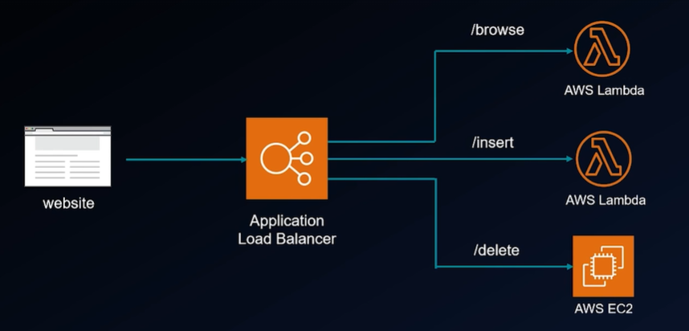

**API Gateway:**
- Fully managed and serverless API service from AWS
- Auto scales up and down
- Infrastructure managed by AWS, highly available, elastic

Typical Pattern API Gateway Integration

Differences Between ALP vs. API Gateway

# IMPORTANT: Scaling - Vertical vs. Horizontal
Lets say you have an app running in a server.
- If no traffic on server, cou utilization is zero.

If traffic grows and increases cpu utilization close to max and server can't handle traffic

## Vertical Scaling
- If you have to scale the server, one option is to add more RAM to server (go to bigger server)
- add more resources to your server

**Vertical Scaling deep dive:**
- You will bring up a bigger server then load app
- cut over traffic from smaller server to bigger server
- then delete the smaller server
- there is a cut over time period where app will be down during change

Lets say traffic reduces.
- Since you are now on a bigger server, you now have to pay for the bigger server
- you do not want to go back and forth

### Challenges of Vertical scalling
- Scaling up/down takes longer
- Chance of missing transactions during scaling cutover
- limited scaling (servers only come up to certain cpu and memory)
    - vertical scaling not ideal for massively scalable distibuted system and is expensive

## Horizontal Scaling
Instead of moving app to a bigger server, you will spin up another server with your app running in it and new traffic will go to this server

**Horizontal Scaling deep dive:**
When new server comes up, load balancer simply send traffic to new server
- Load balancer points to auto scaling group
- There is no trasition or cutoff period
- Scales up/down faster
- Massively scalable
- cost effective since you do not need to move to more expensive/powerful servers
- Legacy code needs to be refactored for horizontal scaling

# VM, Serverless, Container Scaling

**Lambda Scaling**
- can only scale horizontally
- For each traffic, a new instance of your lambda spins up

**Container Scaling**
- For kubernetes, container runs in a pod
    - as traffic goes up, it will create another pod within the same EC2 so new pod starts getting traffic
    - Each EC2 can have certain number of pods and, once cpu filled, you will have to scale the EC2 which is referred to as **cluster auto scaler**

- For Fargate, there is no underlying ECS and AWS manages where pod is running
    - at certain point the Fargate scales and creates another pod running the container for app

# Real World Interview Tips on Scaling
Lets say interviewer asks you:

## How can you make your app scalable for a big traffic day?

- I will put my VMs into an auto scaling group behind Elastic Load Balancing
- If we let load balancer to scale up naturally, it might not be able to keep up
    - I will PRE-WARM LOAD BALANCERS to handle big traffic bump
    - I will utilize SCHEDULED SCALING which will have multiple amazon EC2s up and running to handle huge traffic
    - I will ensure application machine image (AMI) IS LIGHTWEIGHT (because more unecessary libraries/packages means longer to spin up EC2's in scaling)
    - If app is connecting to database USE DATABASE PROXY (ex. RDS proxy) to maintain database connection
        - Usually instead of reusing that connection it will create a new connection and result in multiple open connections which uses computing from database
    - Run IEM (Infrastructure Event Management) to ensure it can handle high traffic
        - Event that AWS runs before big traffic day so that it will scale up
    - Also check account limit for AWS account
    - Utilize different Account + Region Combo

Also talk about breaking app into microservices which can allow a heavy hitting API to scale a lot more without impacting other microservices

### Serverless Scaling
- Before big traffic day, ensure the provisioned concurrent (Scheduled) so it will pre-warm certain number of Lambdas for high traffic
    - Provisioned Concurrency can be done in an auto scaling way or scheduled manner
- Optimize Lambda code using X-Ray
- Optimize Lambda config using CloudWatch Insights

For API Gateway
- Enable API caching
- use HTTP API instead of REST API if possible
- Check account limits
- Utilize different Account + Region Combo

### Going into kubernetes
- Use HPA of horizontal pod auto scaler
- Use rs or Replica Set to run multiple copies of pod so it can handle increased traffic
- Use Cluster Autoscaler to provision additional nodes
- Pre-warm load balancers
- Use Proxy database

# Synchronous vs Event Driven/Async Architecture
When you have 3 microservices and they are hitting 3 different backends
- In all cases the caller is expecting a result in the same invocation

A look into the serverless option

## Synchronous Architecture:
- Caller will invoke the API and wait for response during SAME invocation

### How does sychronous architecture scale
Lets say multiple users start executing same API
- Gateway, Lambda and database have to scale
    - but if Lambda eventually reaches limit, any calls after will fail

**Challenges in Synchronous Architecture**
- All components of sync architecture MUST scale together
- Consumer needs to resent tranaction for re-processing
- Expensive

## Event-Driven/Async Architectrure
We decouple the components and buff messages until services are available to process
- Instead of API gateway calling directly to Lambda, API put messages into Amazon SQS (simple queue service) to control rate of consumptions

**Advantages**
- Each component can scale independently
- Retry built in (frontend/user does not need to resend messages)
- Cost effective than synchronous architecture

## Use sync and async architectures together where applicable
Examples where they are used together

Ordering systems
- Order inserts can be done event-driven
- Order status retrieval can be done syncronously since it is more lightweight and components of this can be cached

# IMPORTANT Queues and PubSubs Architecture (popular topiC in whiteboarding interview)

## Queue Architecture
System A puts messages into a pipe/queue and System B reads from queue
- System A can scale and put as many messages in queue and System B can process at its own pace
- Consumer is pulling messages out of queue and once it reads and process message it will be deleted
- Considered a pull model since System B pulls messages
- Examples are SQS and Amazon NQ

## Pub-Sub Architecture
System A will publish message to a topic
- There could be multiple consumers (System Bs) in this model
- considered a push model
- Once message gets published to topic, it will get pushed to all subscribers of topic
- Example: In cell phone you get a waether alert
- Example: SNS (Simple notification system) and Amazon event page

# Streaming vs Messaging
Messaging - a single message is the unit of 1
- example could be using SQS, SNS, Eventbridge
    - message could be a json with name, account, balance
    

Streaming - a single message doesn't give you the full picture
- only by looking at the whole stream of messages together we understand whats going on
- example could be website click stream traffic which puts where ever you are clicking into stream
    - If B looks at 1 click event, it doesn't get the whole picture
- this is a constant flow of messages
- Can run SQL queries or build graphs in the stream itself
- Since messages are not getting deleted, the consumer or other process needs to track position in stream
- Examples are Kinesis and MSK (Amazon message streaming for kafka)

# SQL vs NoSQL Dayabase and Aurora vs DynamoDB
### One you of the most common interview questions:
### Can you tell the difference between SQL and NoSQL database

## SQL Database
- Tables have predefined schema
- Holds structured data
    - Advantage of predefined schema - indexes and foreign keys are more optimized because the database know what columns there are
- good fit for joins and complex queries (left outter join, sub queires, etc.)
- Emphasizes on ACID properties (Atomicity, Consistency, Isolation and Durability)
- Generally, scales vertically (if you need more cpu, need to select bigger server)
Examples: Oracle, DB2, Amazon Aurora, AWS RDS

## NoSQL Database
- Schemaless
- holds both structured and unstructured data
    - difficult to hold different kinds of keys
- Generally not a good fit for complex multi table queries
- Follow the Bewers CAP theorem (Consistency, Availability and Partition tolerance)
- Generally, scales horizontally. AWS and DynamoDB scales automatically (You do not need to go up on server size but instead can add additional servers)
- Example - AWS DynamoDB, MongoDB, Cassandra

## Amazon Aurora
- MySQL and PostgreSQL compatible relational database built for cloud. 5 times faster than standard MySQL, 3 times faster than standard PostgreSQL at 1/10th cost
- Multi-Master Supported for MySQL
    - in event of failures, it enables database to maintain read and write with 0 downtime
- Cross region Active-Passive replication Supported for MySQL
    - designed for globally distrubuted apps allowing single database to span multiple AWS regions
- Choosing multi-AZ & Read Replicas provide High Availability
- Vertical scaling. Serverless Aurora scales automatically, not as scalabale as Dynamo
- Has integated caches, can't be adjusted
- Enable backups, snapshots for DR

## Amazon Dynamo DB
- Key-value and document database with signle-digit millisecond performance AT ANY SCALE
- Multi-Master
- Cross region Active-Active replication Supported (Golbal Tables)
    - You can write in either region for this table
- Inherently replicates across three AZs - HA and Durable
- Inherently Scalable, can handle more than 10 trillion requests/day and peak 20 million/sec
- Provide adjust in-memory caching via DAX
- Inherently durable, Point in time backups can be enabled

# Websockets for Server to Client Communication (Ex. Chatbot)
Request-Response

Usually client invokes API (Ex. get bank balance or get item description)
- server can NOT initiate connection to client

### What if server need to send data to client?
Achieved using websockets connections
- initially the connection is established and stays open so client and server can call each other
- Can be achieved using load balance or API gateway
- use cases: chats like WhatsApp, Telegram, etc.

# Caching - What and Why?
System architecture generally looks like:

At times, backend is running complex queries and taking capacity of DB

### This is where caching comes into play
- purpose is to increase data retrieval performance by reducing need to access underlying slower storange layer
- typically stores a subset of data in memory which has much lower latency in contrast to databases
- Backend first checks cache if data is present before querying data
- You can cache at any part of your system

### How does cache get deleted?
- Cache entries deleted after specified time or Time To Live (TTL)
- Cache entries can be updated with backend code
    - like another db system

### Which Caching service to use?
- Use managed caching of the service you are using
    - Ex. with API gateway use the caching feature of API gateway otherwise you cache dsatabase if no cache service

# Redis Memchached & Caching Strategies
## Redis and Memcached
Both are open source memory based caching systems

Amazon Elasticache does the heavy lifting for some of management aspects of redis and memcached

Memcached is much simpler than redis

Redis supports more complex use cases such as advanced data structures

## Caching strategies
This determines when and how cache gets populated

### Lazy Loading
- When user or app tries to read something, app code first checks the cache
    - if info is found it is refered to as cache hit
    - if info is not found it is called cache miss and code goes to underlying storage and backend code writes this data to cache

Features:
- Only requested data is cached
- There is possibility of stale data (if cache has data but data was updated in database)
    - cannot update stale data with lazy loading

### Write-Through
When user is writing data to database, during this write the code inserts data to cache

Advantages
- data in cache is never stale

# High Availability
System continues functioning even when some of it's components fail
- System guarantees certain percentage of uptime
- Important to identify single point of failure such as:
    - Server running your app
    - Database
    - Load balancer
    - Analyze each component and validate single point of failure

## How to achieve high availability on cloud
Lets say yyou have single load balancer sending traffic to single EC2
- generally load balancer is a single point of failure
- However, in cloud (AWS, GCP, Azure) elastic load balancer is inherently highly available
- single Amazon EC2 is NOT highly available
    - There is a delay to spin up server

### To achieve high availability
- deploy the app into 2 EC2s each in different availability zone and put into an auto scaling group
    - in this case even if one EC2 goes down the system will still function since other EC2 is running
- Acieving high availability costs extra money

Which is an option which is automatically highly available
- Lambda - under the hood each Lambda is deployed into multiple high availability zones
- Kubernetes - you will have a elastic load balancer sending traffic to a pod which is in a container which is in an EC2 worker node
    - This by itself is not highly available
    - Need to run same copy of container in 2 different pods and each pod should run in 2 different EC2 nodes in 2 different availability zones
    - This can be inside a kubernetes scaling group or cluster auto scaler
    

**INTERVIEW NOTE:** Do not over index on cost when you design or answer interview question
- generally it is more desired to have a system highly available than be cost effective

# Difference between High Availability vs. Fault Tolerance
High Availability ensures system will keep serving traffic even if one availability zone goes down.

What happens when 1 high availability zone goes down?
- if 2 EC2 can handle 50 transactions per sec (TPS)
    - If one goes down then auto scaling group will spin another EC2 but during that time the performance will be reduced to 50 TPS
    

This is where Fault Tolerant architecture comes into play
- Not only is system is highly available but performance does not degrade even if a system component fails
- you can deploy 3 EC2s in 3 different availability zones each handling 50 TPS

- Fault tolerant system is more expensive than highly available system

In whiteboarding interview, pay close attention to whether you need to design a highly available system or a fault tolerance system

# Distributed Systems
Before going into this lets look at the opposite:
- Centralized Systems
    - use a client server architecture where 1 or more clients are directly connected to a central server
    - this creates a signle point of failure in the single server
    - to scale you add more cpu and memory (migrate to bigger server - vertical scaling)
    - Examples: Any app running on local machine, IBM Mainframe, Apps running on single datacenter server

### Distributed System AKA Distributed Computing
- system where multiple components located on different servers that communicate and coordinate action to appear as a single coherent system to end user
    - You will have a load balance to spread traffic on backend servers
    - Even in one server goes down it will still run
    

How do you scale distributed systems?
- add more servers (horizontal scaling)
- most modern systems are distributed
- no single point of failure

# Hashing
Process of feeding a message of any length into a hash function that produces a fixed sized string

Properties:
- Same input will always create same output
- Little change in input should create a vastle different output
- hash function should be fast

### How is hashing important in system design?
In real world system design, tables need to scalable
- tables are partitioned into multiple tables of shards
- hashing is applied to the primary key to determine which partition the data should reside
- Ex. Partition key is Artist and Sort key is song
    - hash function runs on artist field (Dua Lipa) and generates string and convert string into number then stores into partition
    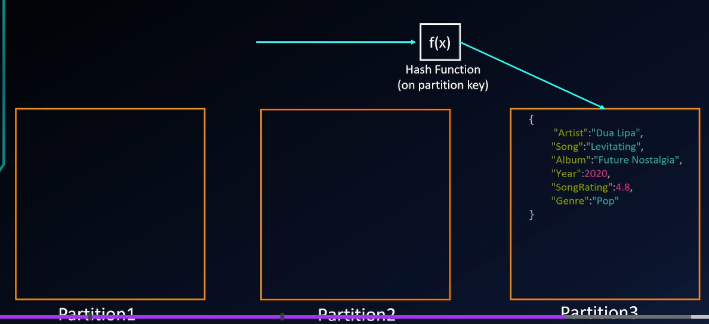

## Challenges of Hashing
Lets say a server goes down or a new one is added
- That ends up remapping entire system
- this can be solved using consistent hashing

# Consistent Hashing
### How does consistent hashing solve the re-map?
Imagine we have a hash ring
- With every incoming request, there is a request id which is used as input to hash function which generates number output
- circle will be uniformly divided into those numbers (ex 0-99 would divide into 100 parts)
- addition to hash function, consistent hashing involves performing a hash function on a unique id of the server
    - Each server will have a unique ID
- Once you have both hashes
    - Ex. request can be assigned to server hash directly clockwise of request hash

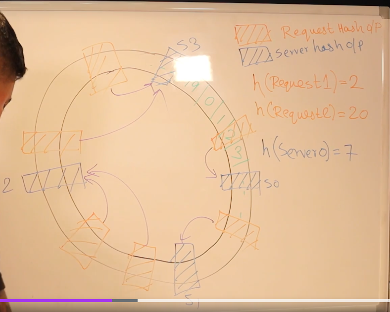

### Advantages
Lets say a server 0 gets removed
- Only some requests will be remapped but all other requests will now be impacted
    - Ex. request 2 on image
    
- uniformly distributes load of backend server
- in case of disruption, there should minimum remapping and rerouting

### How to solve problem of if 1 server getting too many requests?
- Instead of adding more servers, run same server id through multiple hash algorithm
    - That server will show up multiple times on hash ring
    - this server is just a replica (NOT another VM)
- If a specific server is bigger than others, then you can run more hash functions on that server since it can handle traffic

**Practical Implementations**
- load balancers
- Used with backend database server

# Database Sharding (Horizontal Partitioning)
If traffic goes up for app, Load balancer and EC2 can scale up easily
- if traffic exceeds capacity of database, there will be somr app disruption

How can you scale database?
- vertical scaling (not ideal)
- Use database sharding

### Database Sharding
- Database architecture pattern where you separate one tables rolls into multiple different tables known as partitions or shards
- Each partition has the same schema and column but different rows
- Depending on id, app can divert traffic to different shards
    - Uses hashing to assign which shard row should go to

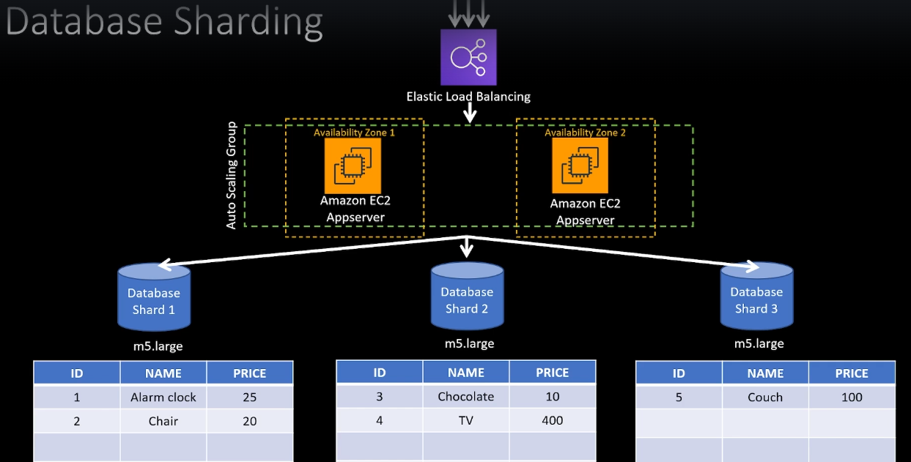

**Advantages**
- allows database to scale horizontally
- faster query reponse times
- limited blast radius during outage

**Disadvantages**
- Unbalanced shards over time making that specific shard have slower response time
- mitigated by resharding but this is painful because it might change hash algorithm
- implementing sharding logic is an overhead

# Common Interview Question: How will you achieve Disaster Recovery?
There are multiple approaches to DR:
- Active-Active is NOT the only one (replicate database so everything will be running in 2 places)
- Select strategy depending on RPO/RTO of application

### RPO (Recovery Point Objective)
The amount of DATA that is allowed to be lost during a disaster measured in time

Example:
- lets say you back up storage database every hour
- if storage goes down at 59 mins 59 secs, you lose that data

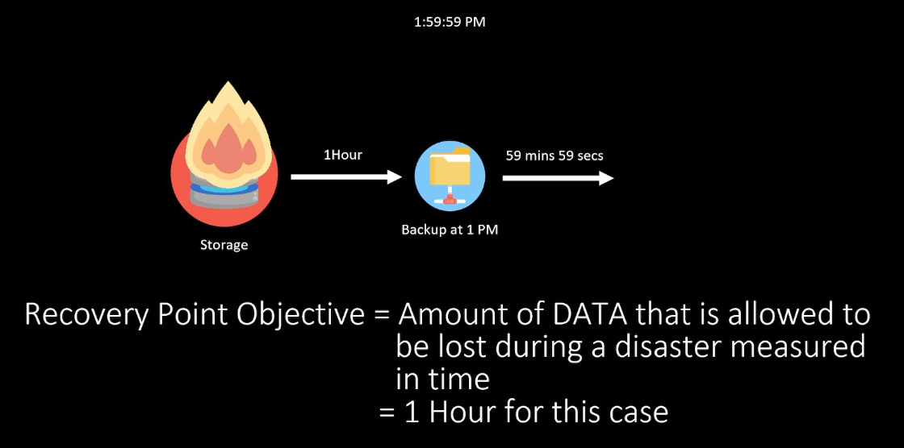

How will you reduce RPO?
- Take frequent backups

How do you achieve real time RPO (no downtime)?
- For storage you need real time replication
- As soon as one region goes down, the second region data is already up to date

### RTO (Recovery Time Objective)
Amount of TIME app can be down during a disaster
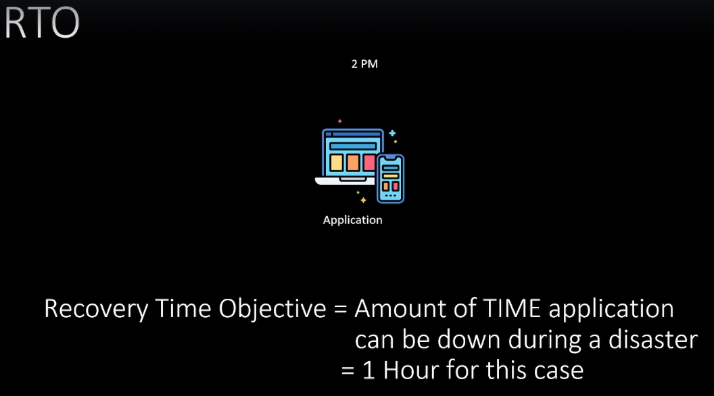

## Disaster Recovery Strategies
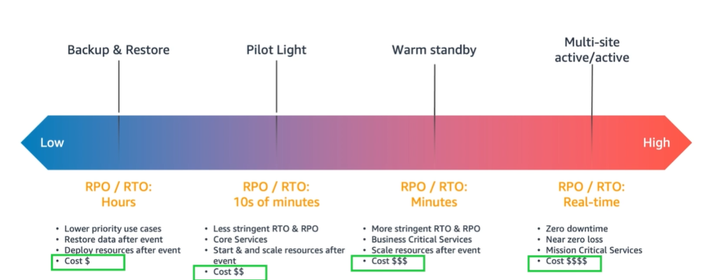

### Strategy 1: Backup Restore (Highest RPO/RTO)
- Only thing that is being replicated to another region is the backup
- Can have longest RPO/RTO
- On 2nd region, no instances, databases or load balancers are running
    - In case of disaster, you will run infrastructure's code using this backup for database, EBS and amazon machine images
- Cheapest option but takes longer because everything need to be provisioned from scratch

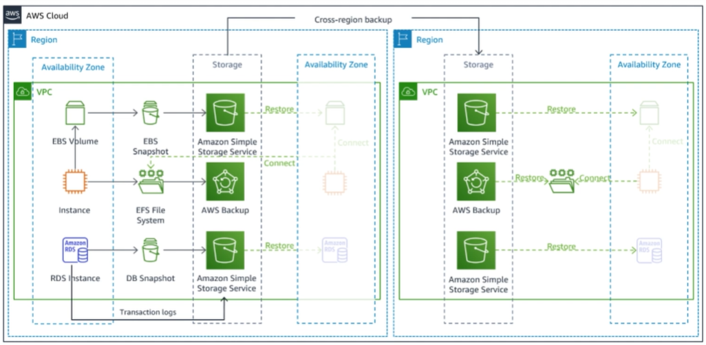

### Strategy 2: Pilot Light
- This keeps bare minimum core infrastructure running in the disaster recovery region so that in case of disaster so that app can be brought up faster than Backup Restore strat
- In this case, if core part of app is data the database is up and running
- database is being replicated
- Database replica and ECS2 are turned off
- note that Load balancer and auto scaling groups are ready to go
- In this case, data is replicated using Aurora's global database feature
    - if interviewer you database that does not have this feature, you need to replicate it using some custom app, open source tools or product

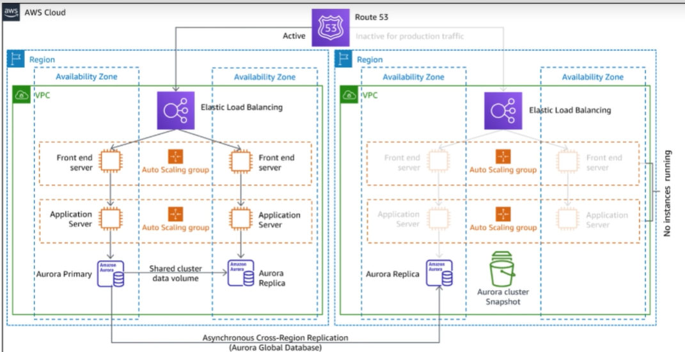

### Strategy 3: Warm Standby
- Involves that there is a scaled down but fully functional copy of production environment within another region
- decreases time to recovery because there is a copy turned on in another region but it is not fully turned on
    - In auto scaling group, only on server is running

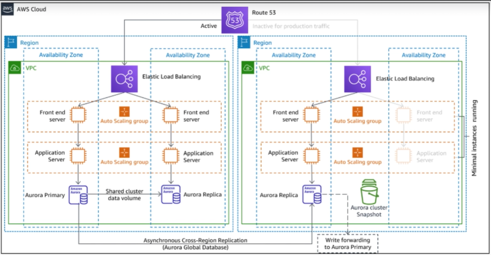

### Strategy 4: Multi-site Active/Active
Most Popular, Most Expensive
- Another copy of whole app is running in another region

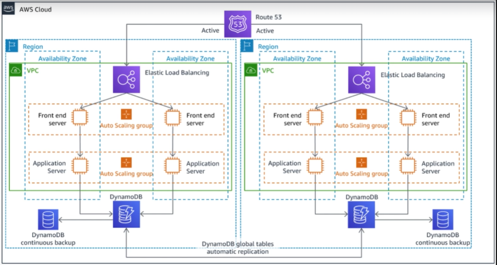

# CAP Theorem
### C - Consistency
- Every read receives the most recent write or an error
### A - Availability
- Every request receives a non error response, without the guarantee that it contains the most recent write
### P - Partition Tolerance
- **partition** - If connection between 2 node in a database is disconnected
- The system continues to operate dispite an arbitrary number of messages being dropped (or delayed) by network between nodes

Lets say we have 2 nodes in database
- if something is written in node A, it is replicated to node B and vice versa
- ex. store back account balance
- This is consistent because the Read is giving most up to date value
- This is available because every request is giving non error response
- partition is running
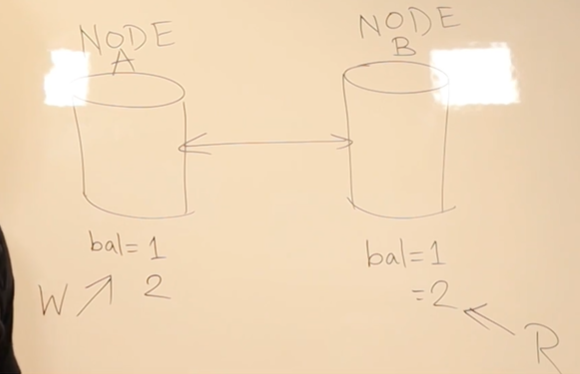

### CAP theorem states that you can only achive 2 of the 3
- Reality is that in any distributed system, you cannot ensure partition will always stay up and running
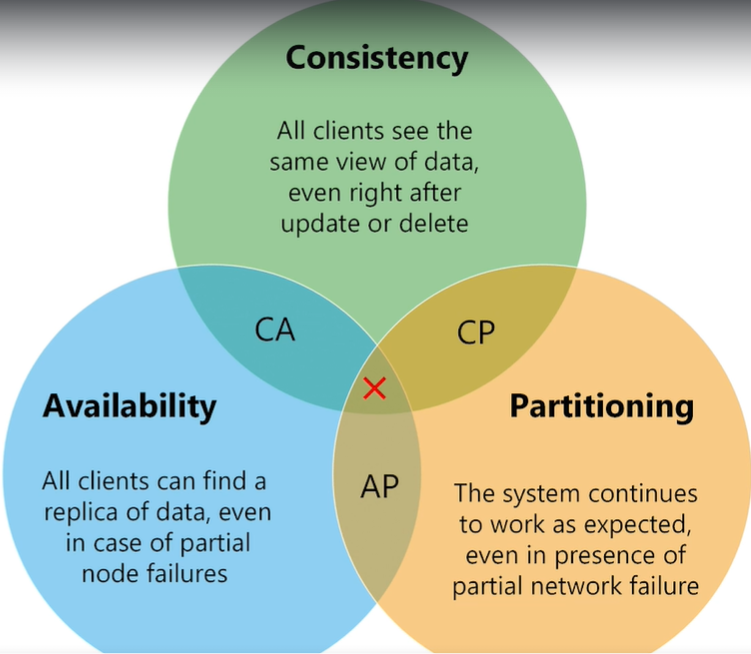

For AP

Lets say connection is severed
- Write request comes to update balance of 3
- Read will read 2 still since connection is severed
- This means system is only available and partition tolerant (can still write and read even if data isnt consistent)

For CP

- Dynamo DB has option called Strongly Consistent Read which returns error if node detects there is a disconnect leading to no availability
- Partition means that it will give some sort of data back but does not guarantee it will be consistent data

For AC
- Not possible for distributed system
- Theoretically, Relational databases do this (consistency is highly valued)
    - You have primary node and data gets replicated to secondary nodes
    - if connection is partitioned, it removes the node and stops sending any traffic to that node
        - previously you can still read and write

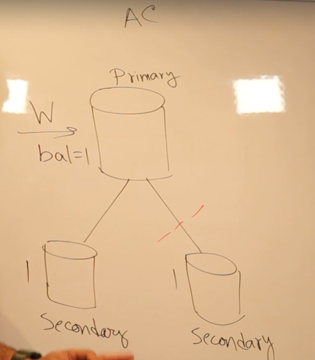

### When should you choose what?
Ex. Let say bank with ATMs, you deposit at an ATM
- You go to other ATM but connection is severed and you tried to retrieve balance but it does not show last deposit
- In this case banks would focus on consistency over availability since they would not want to display wrong balance to customer

Ex. In social media, you post a pic and it gets liked
- sometimes likes aren't updated right away
- availability is more important that consistency

Ex. Lets change ATMs to nodes in above image and for Facebook, it is more important that nodes keep solving the traffic
- One option is to create redundant connections in between
    - this becomes expensive since connections are actual fiber optic cables, not just software
    - not realistically feasable
- More practical way to resolve this
    - Have one connection
    - You could allow writes and have time stamps for each write on both nodes
    - when connection is restored, system can reconcile based on timestamps and bring system to correct states
    

### Drawbacks of CAP Theorem
- does not consider some factors such as scalability, latency and security

If you build a retail app, Scalability is important
- Someone says you can go with database that gives A or C but does not scale as much as NoSQL which gives CP or AP
    - must do calculation of chances a partition can go down by looking at prev history of outages is less than 1% then go with scalable app

### Some common interview questions are:
- What is C - consistency (read receives most recent data or error)
- What is A - availability (every request receives non error response even if data not updated)
- What is P - partition tolerant (system continues to operate even if connection severed)
- How can you achieve all of those? How can you achieve CP?
